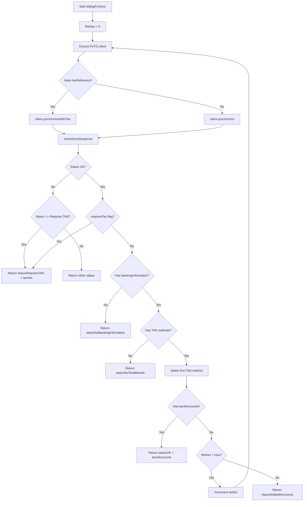

# FinTS Integration Overview

The `FinTS` class wraps the `lib-fints` client to:
- Initialize and cache a FinTS client instance (singleton style).
- Perform synchronization (with or without TAN).
- Select a TAN method automatically (first available for now).
- Retrieve accounts, statements, credit card statements, and (placeholder) portfolio data.
- Normalize responses into status codes for upstream consumers.

## Status Codes

Returned in objects from high level operations (e.g. `dialogForSync`):
```
0  statusOK
1  statusError
2  statusWrongPIN
3  statusRequiresTAN
4  statusNoBankAccounts
5  statusNoBankMessages
6  statusNoBankingInformation
7  statusNoBankingInformationUpdated
8  statusNoTanMethods
```

## Core Responsibilities

- Client lifecycle: lazy creation via `#ensureFintsClient` and reuse unless constructor input changes.  
- Synchronization flow with retry for missing accounts.  
- TAN handling:  
  - If bank requests TAN: return `statusRequiresTAN` plus challenge data.  
  - If TAN reference + TAN provided: continue prior pending dialog.  
- Error interpretation: detect wrong PIN (bank answer code `9910`).  
- Account + statement retrieval with date defaults (last 14 days if no range).  

## `dialogForSync` Behavior

High level:
- (Re)create client if needed.  
- Run synchronize (with or without TAN reference).  
- Interpret response:  
  - If failure: return `statusError`.  
  - If wrong PIN: `statusWrongPIN`.  
  - If TAN required: `statusRequiresTAN` + challenge.  
  - If no banking information: `statusNoBankingInformation`.  
  - If no TAN methods: `statusNoTanMethods`.  
- Select the first available TAN method (TODO: make configurable).  
- Extract bank accounts; if absent, retry up to `#maxFinTsRetrys` (currently 4).  

## Mermaid: Synchronization Flow (`dialogForSync`)



## Public Methods Summary

- `static from(...)`: Retrieve or create singleton; updates TAN reference if reusing.  
- `dialogForSync()`: Full synchronization with TAN logic + retries.  
- `synchronize() / synchronizeWithTanReference()`: Lower-level sync stages.  
- `getAccounts()`: Returns cached accounts (after successful sync).  
- `getStatements(accountNumber, from?, to?)`: Fetch account statements (fallback to credit card).  
- `getCreditCardStatements(accountNumber, from, to)`: Specialized retrieval.  
- `getPortfolio(accountNumber)`: Placeholder portfolio retrieval.  
- `getBankAnswers()`: Raw bank response messages.  

## Extension / TODO Ideas

- Configurable TAN method selection.  
- Pluggable logging abstraction.  
- Structured error objects instead of numeric status codes.  
- Persistence of session / BPD / UPD data across process restarts.  
- Rate limiting + backoff on transient failures.  

## Error Handling Notes

- Unexpected exceptions inside `dialogForSync` produce `{ status: statusError }`.  
- Wrong PIN detection relies on bank answer code `9910` (may need adaptation for other banks).  
